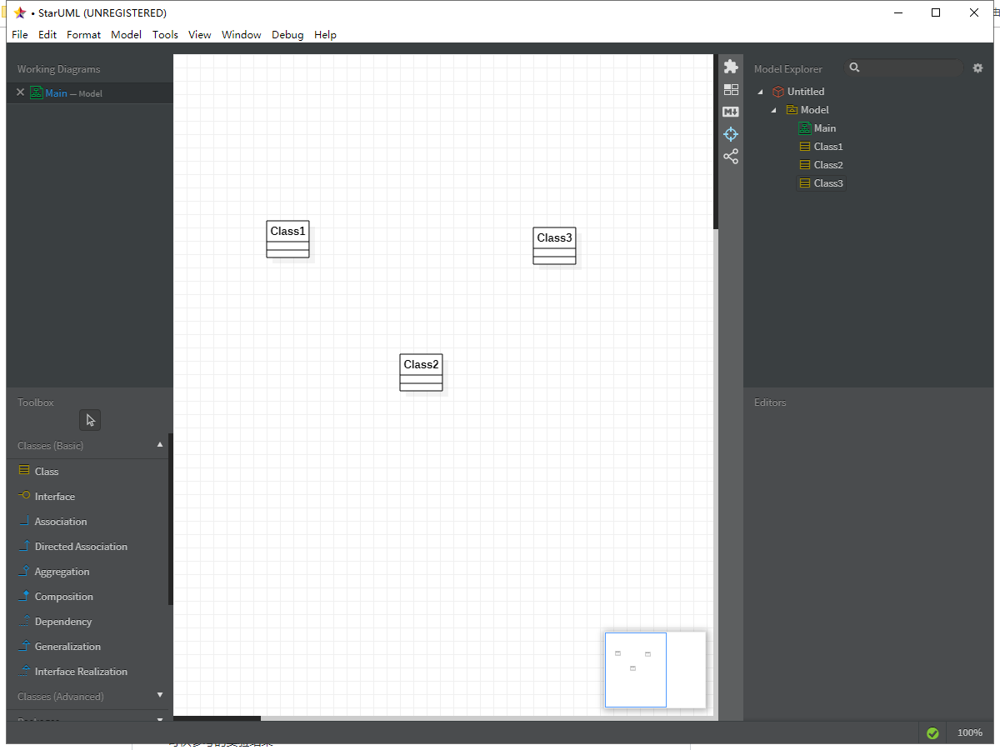

# 实验内容

1、下载并安装建模工具 StarUML，下载地址：http://staruml.io

2、确定个人建模选题，将选题填写在 Issues 中：
https://github.com/hzuapps/uml-modeling-2020/issues

# 实验要求
1、工具安装之后，打开并截图，保存在实验报告中；

2、将个人选题及描述写在实验报告中，具体要求：

- 选题标题为软件名称；

- 描述中写出2-3个功能需求（不允许写“注册”和“登录”）；

- 选题功能应该包含数据库的使用。

3、实验报告将按照『教学助理』小程序的要求提交（此步骤延后）。

# 实验步骤

1、下载上课时所需要的软件StarUML和Git

2、注册git账号，fork老师的仓库并且clone到本地

3、创建一个label1.md文件

4、使用StarUML创建一个UML文件并且导出为jpg格式

5.提交文件到本地仓库和远程仓库

6.发起合并到请求

# 建模选题

## 选题标题：留言板
## 功能列表
- 发布留言
- 回复留言
- 消息通知(绑定微信或者手机号)